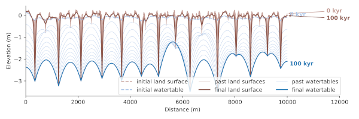

# GOEMod: Groundwater flow, overland flow and erosion model

## Introduction

GOEMod is a coupled model of steady-state groundwater flow, overland flow, hillslope diffusion and stream incision. The model was inspired by a coupled streamflow and groundwater flow model by de Vries (1994), and adds erosion processes to this model. The model is simplified in that it simulates water fluxes and erosion in a 2D cross-section that runs perpendicular to the direction of a series of streams. Erosion and transport in the out-of-plane direction are taken into account by integrating sediment fluxes for a fixed upstream area. The model simulates the evolution of a stream network and shows the importance of groundwater capture, in which faster incising streams draw the watertable below neighbouring streams, which fall dry and stop incising.

## Getting started

The model is contained in the Jupyter notebook [goemod.ipynb](goemod.ipynb) which can be used to adjust the model parameters, execute a single model run and make several figures and an animation of the model results

In addition, you can run multiple models using the python script [goemod_multiple_runs.py](goemod_multiple_runs.py). After finishing these model runs you can make figures of the model results using the notebooks [sensitivity_analysis_figure.ipynb](sensitivity_analysis_figure.ipynb) and [figures_model_runs.ipynb](figures_model_runs.ipynb). The results are also saved to a comma separated file, see for example [model_results/model_sensitivity_results.csv](model_results/model_sensitivity_results.csv).

## Installation

* Download the zip file or [clone](https://docs.github.com/en/github/creating-cloning-and-archiving-repositories/cloning-a-repository) the repository.
* Unzip the file, navigate to the directory and run the [Jupyter](https://jupyter.org/) notebook [goemod.ipynb](goemod.ipynb).

## Required Python modules

GOEMod requires the following Python modules:
[numpy](https://numpy.org/), [matplotlib](https://matplotlib.org/), [pandas](https://pandas.pydata.org/)

In addition [Jupyter](https://jupyter.org/) needs to be installed to be able to run the notebooks.

Note that all of these modules and Jupyter are included in a Python distribution such as [Anaconda](https://www.anaconda.com/distribution/)

## Authors
**Elco Luijendijk**, <elco.luijendijk-at-posteo.de>

## Reference
The model code and results are described in a manuscript that is under review at the journal Earth Surface Dynamics:

Luijendijk, E.: Transmissivity and groundwater flow exert a strong influence on drainage density, Earth Surf. Dynam. Discuss. [preprint], [https://doi.org/10.5194/esurf-2021-33](https://doi.org/10.5194/esurf-2021-33), in review, 2021. 

The model code itself has also been published at Zenodo:

Elco Luijendijk. (2021). GOEMod: groundwater flow, overland flow and erosion model (v1.0). Zenodo. https://doi.org/10.5281/zenodo.4663728

## License
This project is licensed under the GNU lesser general public license (LGPL v3). See the [LICENSE.txt](LICENSE.txt) file for details.

